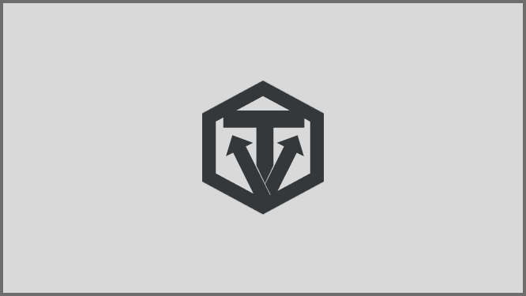

# Olá, seja bem-vindo(a) à nossa organização! 👋  

  

  

## Sobre a VitalisTech  

A **VitalisTech** é uma empresa de tecnologia focada em conectar profissionais qualificados a pessoas que buscam cuidados especializados, promovendo **bem-estar, qualidade de vida e eficiência no setor fitness**. Nossa missão é facilitar o acesso a serviços personalizados, utilizando inovação e automação para otimizar a gestão de academias, personal trainers e demais profissionais do segmento.  

Nosso compromisso vai além da tecnologia – **colocamos a empatia, a qualidade e a ética no centro de tudo o que fazemos**. Garantimos que nossos produtos e serviços atendam às necessidades dos clientes com confiabilidade e eficiência, permitindo uma experiência mais personalizada e acessível.  

---

### 🦘 Sobre a CaringU
 Através do **CaringU**, nossa plataforma principal, capacitamos profissionais com ferramentas que simplificam a gestão, melhoram o acompanhamento de alunos e potencializam a personalização dos treinos. Alinhada às principais tendências do setor, como **digitalização e automação**, a **CaringU** transforma a maneira como profissionais e alunos interagem e evoluem juntos.  

Com uma abordagem centrada na tecnologia e na inovação, a empresa se posiciona como uma **parceira estratégica para a modernização do setor fitness**.

## 🌟 Equipe  

Aqui estão os membros da nossa equipe:  

👨‍🚀 [Bianca Souza](https://github.com/biasouza21)  
👨‍🚀 [Gustavo Kohatsu](https://github.com/Gustavo-Kohatsu)  
👨‍🚀 [Igor Daniel](https://github.com/zack-css)  
👨‍🚀 [Lucas Cancela](https://github.com/LucCancela)  
👨‍🚀 [Pedro Franchi](https://github.com/PedroFranchi)  
👨‍🚀 [Rafael Sung](https://github.com/Rafaelsmlee)  

##  Missão, Visão e Valores  

**Missão:** Conectar profissionais qualificados a pessoas que precisam de cuidados especializados, promovendo bem-estar e qualidade de vida.  

**Visão:** Ser a principal plataforma de conexão entre profissionais de cuidado e pessoas que necessitam de assistência, tornando o acesso a cuidados especializados mais rápido e confiável.  

**Valores:** 

• **Empatia** - Colocamos as necessidades dos clientes e profissionais em primeiro lugar.  
• **Compromisso com a Qualidade e Ética** - Garantimos profissionais capacitados e serviços confiáveis, atuando com integridade em todas as nossas relações.  
• **Inovação** - Buscamos soluções tecnológicas para melhorar o bem-estar das pessoas.
